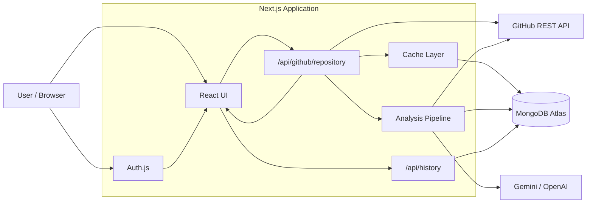
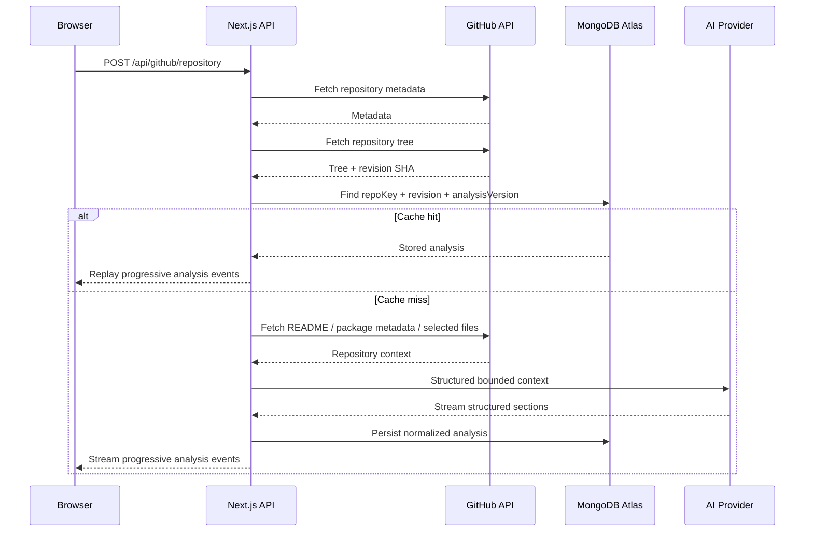
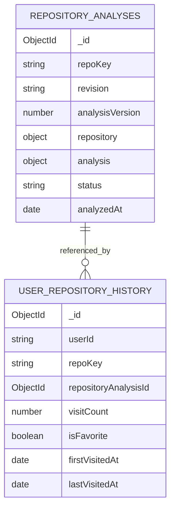
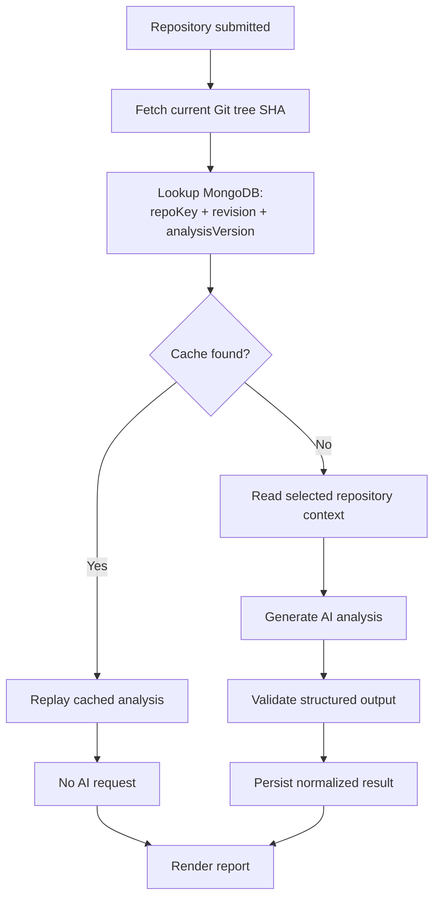

# RepoExplain

> Understand an unfamiliar GitHub repository without reading every file first.

RepoExplain is a full-stack AI-powered developer tool that analyzes public GitHub repositories and turns their structure and selected source files into a structured, beginner-friendly technical explanation.

Instead of sending an entire repository blindly to an AI model, RepoExplain first inspects the repository through the GitHub API, detects its technologies, selects useful files, builds a bounded analysis context, and generates structured sections such as architecture, important files, project structure, and improvement suggestions.

To reduce repeated AI usage and cost, generated analyses are cached in MongoDB using the repository's Git tree revision. If the repository has not changed, RepoExplain reuses the stored analysis instead of calling the AI model again.

---

## Live

**Application:**  
https://repo-explain-plxppq2o0-prahans1.vercel.app/

**Source:**  
https://github.com/prahans/repo-explain

> RepoExplain currently supports public GitHub repositories.

---

## What RepoExplain Provides

Given a repository such as:

```text
https://github.com/owner/repository
```

RepoExplain builds a report containing:

- Repository overview
- Intended audience
- Detected technologies
- Project structure
- Important file explanations
- High-level architecture
- Repository-specific improvement suggestions
- Analysis limitations when evidence is incomplete

The goal is not to claim complete understanding of every line of code. RepoExplain gives developers a useful architectural starting point while explicitly acknowledging truncated, unavailable, or uninspected content.

---

## Core Engineering Ideas

RepoExplain is built around a few principles that go beyond simply sending a GitHub URL to an LLM.

### 1. Analyze selectively

The application does not send an entire repository to the model.

It:

1. Fetches repository metadata.
2. Fetches the repository tree.
3. Detects important files.
4. Reads only selected files.
5. Limits source excerpts and repository structure included in the AI context.
6. Sends a structured context to the AI provider.

This keeps model input bounded and makes the analysis more predictable.

---

### 2. Cache by repository revision

RepoExplain uses the repository's Git tree SHA as a revision identifier.

The effective cache identity is:

```text
repository
+
Git tree revision
+
RepoExplain analysis version
```

Conceptually:

```text
repoKey + treeSHA + analysisVersion
```

For example:

```text
prahans/wanderlust
+
3a4f91c...
+
1
```

If the same repository is requested again and the Git tree SHA has not changed, RepoExplain retrieves the previous analysis from MongoDB.

No new AI generation is required.

If the repository owner pushes a new commit that changes the tree, the SHA changes and RepoExplain generates a fresh analysis.

The separate `analysisVersion` allows RepoExplain itself to invalidate old cached results when the analysis schema or prompting strategy changes.

---

## Cost-Aware Analysis Flow

### First request

```text
User enters repository URL
            │
            ▼
       GitHub API
            │
            ▼
  Read current tree SHA
            │
            ▼
      MongoDB lookup
            │
        CACHE MISS
            │
            ▼
Select important repository files
            │
            ▼
Build bounded AI context
            │
            ▼
       AI Provider
            │
            ▼
Structured repository analysis
            │
            ▼
        MongoDB
            │
            ▼
          UI
```

The expensive AI request happens here.

### Later request — repository unchanged

```text
User enters same repository
            │
            ▼
       GitHub API
            │
            ▼
 Check current tree SHA
            │
            ▼
      MongoDB lookup
            │
         CACHE HIT
            │
            ├───────────────X AI Provider
            │                 not called
            ▼
     Cached analysis
            │
            ▼
          UI
```

RepoExplain still checks GitHub for the current repository revision so that it does not serve stale analysis indefinitely.

However, when the stored revision matches the current revision, it skips the expensive source-context preparation and AI generation.

---

## System Architecture



---

## Request Lifecycle



---

## Progressive Analysis

RepoExplain does not need to wait for one giant response before updating the interface.

The analysis protocol is divided into sections:

```text
overview
   ↓
techStack
   ↓
projectStructure
   ↓
importantFiles
   ↓
architecture
   ↓
improvements
```

The server streams newline-delimited JSON events to the frontend.

Example conceptual stream:

```json
{"type":"repository","data":{...}}
{"type":"prepared","data":{...}}
{"type":"section","section":"overview","data":{...}}
{"type":"section","section":"techStack","data":[...]}
{"type":"section","section":"architecture","data":[...]}
{"type":"complete"}
```

The React client progressively applies these events to the current report.

Cached analyses are replayed through the same event model, so the UI does not need a separate rendering architecture for fresh and cached results.

---

## AI Pipeline

The model does not receive unrestricted repository input.

RepoExplain builds a repository context containing approximately:

```text
Repository metadata
      │
      ├── language
      ├── branch
      ├── description
      └── repository information

Detected technologies
      │
      ▼

README excerpt
      │
      ▼

package.json information
      │
      ▼

Bounded repository structure
      │
      ▼

Selected important file excerpts
      │
      ▼

Structured AI generation
```

Source excerpts and repository context are deliberately bounded before generation.

The application also tracks whether content was truncated or could not be read so that the model can avoid claiming unsupported knowledge.

---

## Structured Output & Validation

RepoExplain uses **Zod** schemas to define the expected AI output.

The generated report is divided into strongly typed sections including:

```text
overview
techStack
projectStructure
importantFiles
architecture
improvements
```

Model output is validated before it is accepted by the application.

For example, architecture nodes must use one of the supported layers:

```text
Browser
Server
External service
Output
```

Improvement recommendations are also validated against known repository paths so the UI does not silently display invented file references.

---

## Prompt-Injection Safety

Repository source code, comments, README text, and configuration files are treated as **untrusted data**.

The AI system instructions explicitly tell the model not to treat repository content as instructions.

Conceptually:

```text
Repository code
README
Comments
Configuration
        │
        ▼
 UNTRUSTED INPUT
        │
        ▼
Structured analysis instructions
        │
        ▼
Validated model output
```

This reduces the risk of a repository containing text that attempts to redirect or manipulate the analysis process.

---

## Persistence Strategy

RepoExplain deliberately does **not** save full source files in MongoDB.

The persistence layer stores useful derived analysis data such as:

```text
Repository metadata
Detected technologies
Project structure metadata
Important-file explanations
Architecture
Improvement recommendations
Section status
Repository revision
Analysis version
```

It does not persist the raw source-code contents used during generation.

This keeps stored documents smaller and avoids maintaining unnecessary copies of repository source code.

---

## MongoDB Data Model

RepoExplain separates shared analysis data from user-specific history.



### `repositoryAnalyses`

Shared cache containing the expensive AI-generated result.

A unique index is based on:

```text
repository.repoKey
source.revision
metadata.analysisVersion
```

This prevents duplicate analysis documents for the same repository revision and RepoExplain analysis version.

### `userRepositoryHistory`

Stores the relationship between a signed-in user and repositories they have viewed.

It contains:

- Visit count
- First visit
- Last visit
- Favorite state
- Reference to the shared repository analysis

Removing an item from personal history does **not** delete the shared cached analysis.

---

## Authentication & Authorization

RepoExplain uses **Auth.js / NextAuth** with GitHub OAuth.

Authenticated users receive:

- Repository history
- Visit tracking
- Favorites
- Ability to remove repositories from personal history

Authentication identity is determined server-side.

History mutation routes verify both:

```text
history document ID
+
authenticated user ID
```

so one user cannot modify another user's history by guessing a MongoDB ObjectId.

Public repository analysis can still be used independently of personal history.

---

## AI Providers

RepoExplain supports:

- Google Gemini
- OpenAI

Provider selection is controlled through environment configuration.

The generation pipeline is intentionally designed around:

```text
one analysis submission
        ↓
one AI provider invocation
```

There is no automatic second-provider fallback for the same request, helping avoid accidental duplicate model charges.

---

## Technology Stack

### Application

- Next.js 16
- React 19
- TypeScript
- Tailwind CSS 4

### Repository Analysis

- GitHub REST API
- Zod
- Progressive NDJSON streaming

### AI

- Google Gemini
- OpenAI Responses API

### Persistence

- MongoDB Atlas
- Mongoose

### Authentication

- Auth.js / NextAuth
- GitHub OAuth
- JWT sessions

### Deployment

- Vercel

---

## Project Structure

```text
repo-explain/
│
├── app/
│   ├── api/
│   │   ├── auth/
│   │   ├── github/
│   │   │   └── repository/
│   │   └── history/
│   │
│   ├── history/
│   └── page.tsx
│
├── components/
│   ├── analysis/
│   ├── ui/
│   ├── Navbar.tsx
│   ├── RepoExplain.tsx
│   ├── RepositoryForm.tsx
│   └── RepositoryHistory.tsx
│
├── lib/
│   ├── analysisProtocol.ts
│   ├── generateOverview.ts
│   ├── progressiveAnalysis.ts
│   ├── repositoryAnalysisCache.ts
│   ├── normalizeRepositoryAnalysis.ts
│   ├── saveRepositoryAnalysis.ts
│   ├── recordRepositoryVisit.ts
│   └── mongodb.ts
│
├── models/
│   ├── RepositoryAnalysis.ts
│   └── UserRepositoryHistory.ts
│
├── types/
│
├── auth.ts
└── package.json
```

---

## Running Locally

### 1. Clone the repository

```bash
git clone https://github.com/prahans/repo-explain.git
cd repo-explain
```

### 2. Install dependencies

```bash
npm install
```

### 3. Configure environment variables

Create:

```text
.env.local
```

Example:

```env
# GitHub API
GITHUB_TOKEN=

# MongoDB
MONGODB_URI=

# Auth.js
AUTH_SECRET=
AUTH_GITHUB_ID=
AUTH_GITHUB_SECRET=

# AI provider
AI_PROVIDER=gemini

# Gemini
GEMINI_API_KEY=
GEMINI_MODEL=

# OpenAI alternative
OPENAI_API_KEY=
OPENAI_MODEL=
```

Use either Gemini or OpenAI according to `AI_PROVIDER`.

Never commit `.env.local` or API secrets.

### 4. Configure GitHub OAuth

For local development, configure the GitHub OAuth callback URL as:

```text
http://localhost:3000/api/auth/callback/github
```

For production, use:

```text
https://YOUR_DOMAIN/api/auth/callback/github
```

### 5. Start the development server

```bash
npm run dev
```

Open:

```text
http://localhost:3000
```

---

## Validation

Before deploying:

```bash
npm run lint
npx tsc --noEmit
npm run build
```

---

## Cache Invalidation

There are two ways an existing analysis becomes stale.

### Repository changed

```text
old tree SHA != current tree SHA
```

RepoExplain performs a fresh analysis.

### RepoExplain analysis logic changed

Increment:

```ts
CURRENT_ANALYSIS_VERSION;
```

For example:

```ts
export const CURRENT_ANALYSIS_VERSION = 2;
```

Existing version-1 cached reports will no longer satisfy the version-2 cache lookup.

This makes prompt/schema changes explicit rather than silently mixing different generations of analysis.

---

## Example Cache Decision



---

## Why the Cache Matters

Without caching:

```text
same repository
×
every visitor
×
every repeat visit
=
another AI request
```

With revision-aware caching:

```text
same repository revision
        ↓
one generated analysis
        ↓
reused by future requests
```

This makes AI usage dependent primarily on **repository changes**, rather than raw page visits.

That reduces unnecessary model calls while still ensuring updated repositories receive fresh analysis.

---

## Current Scope

RepoExplain currently focuses on:

- Public GitHub repositories
- Architecture-level understanding
- Important source files
- Technology detection
- Repository-specific recommendations
- Beginner-friendly explanations

It intentionally does not claim to perform a complete static analysis or review every line in a repository.

---

## Future Ideas

Possible future improvements include:

- Private repository support
- Repository branch selection
- Compare two repository revisions
- Dependency visualization
- Repository architecture graph
- Export analysis as Markdown/PDF
- More granular cache management
- Background re-analysis
- GitHub App integration

---

## Motivation

Large repositories are often difficult to approach when you are seeing them for the first time.

RepoExplain explores a simple idea:

> Before reading thousands of lines of code, give the developer a reliable map of what matters and where to start.

The interesting engineering challenge is not only generating an explanation—it is deciding what repository context is worth analyzing, validating model output, streaming useful results progressively, avoiding unsupported claims, and preventing repeated AI work when the underlying repository has not changed.
